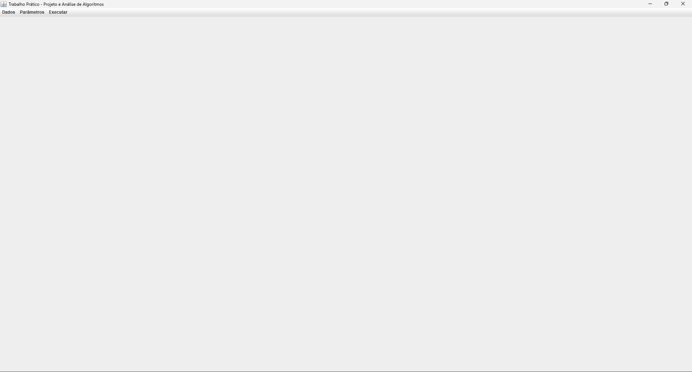
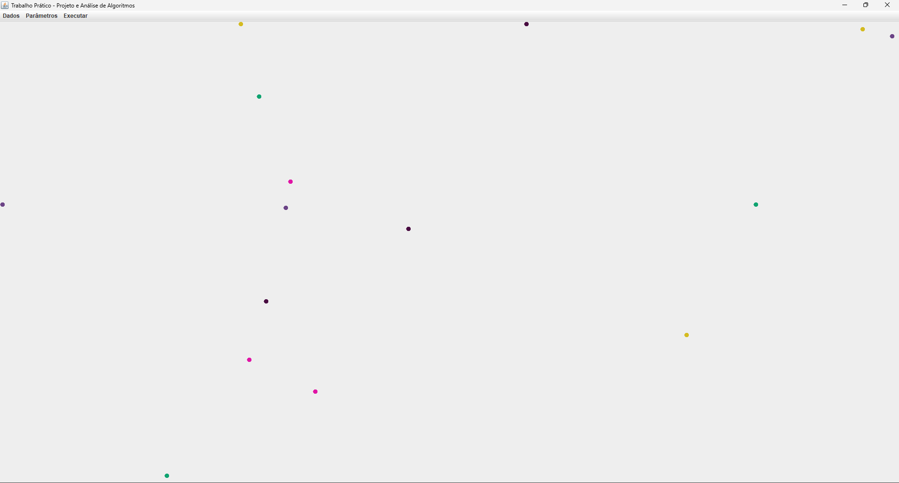

[Versão em Português](README.md)

# Practical Work - Project and Analysis of Algorithms

## Statement

Value: 35 points

Date: 23:00 on 06/10/2024 via Canvas. **Attention: Delays are not permitted for this work!**

### Description

Optimization problems are quite common in various production sectors. An example of application is planning the location of industrial or commercial facilities in a given region of interest. Consider a chain of stores that wants to open n franchises, each for a different franchisee. It is important that stores are not too close together, so as not to compete for the same customers. The company assessed installation costs at several points and needs to choose the solution that results in the lowest total value, respecting a minimum distance between each store.

In this work you must implement a solution to the store location problem that minimizes the total amount spent on installation. For each of the n franchises, there is a list of candidate locations to be chosen. For each candidate point, the installation value and its position in x,y coordinates are known. Any two franchises cannot be less than D kilometers apart, where D is a parameter to be entered on the entry screen. All candidate points have x,y coordinates in the range 0 to 500 kilometers. If a solution that includes the n franchises is not possible due to the distance restriction, the optimal solution with the largest number of franchises must be found.

Information about candidate points must be read from a text file containing one point per line. Each line contains the franchise number, x-coordinate, y-coordinate and installation cost, separated by spaces. All values are integers. Example:

```
1 50 150 2000
1 150 150 1000
2 200 180 500
2 220 200 800
2 300 150 1000
3 100 250 800
3 180 220 500
3 150 300 700
4 220 220 400
4 300 300 1000
```

1. Write a brute force solution to generate the possible solutions and choose the one that leads to the lowest total installation value. The program must graphically show the layout of the candidate franchises and the chosen locations.

2. Write a branch-and-bound solution, based on the brute-force solution, that eliminates branches from the solution tree that prove to be unproductive. Check if the result is the same as that obtained by brute force and compare the processing times of the two solutions.

3. Carry out a set of simulations, generating random files for the values of x, y and cost, varying the number of cities, n, at least between 4 and 20, keeping m=2 and D=1. Run 10 simulations for each value of n and average the execution times. Generate a graph with the average time spent as a function of n. Compare the graphs generated by the 2 solutions.

4. Document the solutions and tests, in the form of a technical report in PDF format with a maximum of 20 pages, according to the SBC standard, containing the following sections:

a) Introduction: General description of the objective of the work.

b) Proposed solution: Briefly describe the algorithms used to solve the problem and analyze their order of complexity in relation to time and memory in the worst case. For the analysis, consider that there are m candidate points for each of the n branches.

c) Implementation: Describe details of the implemented programs, especially those used to improve the efficiency of the solution and how the graphical interface is organized.

d) Test report: Describe the tests carried out and their results, showing what the map looked like in some examples. Record the execution time of each of them. Also show the simulation result.

e) Conclusion: Discuss the results obtained, comparing brute-force and branch-and-bound solutions, regarding their order of time and memory complexity, and regarding the measured execution time.

f) Bibliography according to the ABNT standard.

### General considerations and evaluation criteria

1. The work must be done in groups of two or three students, without any participation from other groups and/or help from third parties. Each student must actively participate in all stages of the work. The group components must be informed by 04/30/2024 in a spreadsheet to be published and cannot be changed. Students who have not formed groups by this date will be grouped by the teacher arbitrarily, into groups of 2 or 3 students.

2. The work coding must be done in Java, C++ or Python. The presentation can be made on a notebook taken by the group or on a laboratory computer. In this case, graphic libraries or any resource that is not officially installed in the ICEI laboratories cannot be used.

3. The works (code and report) must be posted in the form of a compressed file using the ZIP standard, with a **maximum size of 5 MB**, and its name must be the registration number of one of the components (Ex:346542.zip ). **The source and report files must be in the root directory** and must contain the name of all group components at the beginning of the code. The presentation will be made using the code posted on Canvas.

4. **Equal works, in their entirety or in parts, copied, “commissioned” or other such barbarities, will be severely penalized. It is the student's responsibility to maintain confidentiality about their work, preventing other students from having access to it. In the case of copying, both works will be penalized, regardless of who harmed or was harmed in the process.**

5. A formal warning will be requested from the Board in the case of bad faith copying.

6. During the presentation, questions may be asked regarding the work, which will be considered for evaluation purposes. All participants must attend and be able to answer **any questions and/or change the code for any part of the work.** Assessment will be individual.

7. The evaluation will be based on the following criteria:

   * Correctness, robustness and efficiency of programs in terms of processing time and memory usage

   * Compliance with specifications

   * Clarity and coding style (comments, indentation, choice of names for identifiers, parameterization)

   * Report

   * Individual presentation

## Screenshots



*Main window, when the program starts*


*Window for generating random data*



*Main window, showing the map of chosen points*


*Results window, showing the solution found and the time spent*

![Main window and results window. The Main Window: with several dots of different colors spread around the screen; and a menu bar with the menus: 'Dados' (Data), 'Parâmetros' (Parameters) and 'Executar' (Run). And the results window: with the title 'Resultado' (Result), a table filled with the following columns: 'Número franquias' (Number of franchises), 'Coordenada X' (X coordinate), 'Coordenada Y' (Y coordinate), 'Custo' (Cost) and 'Cor' (Color), filled with data, and a bottom bar with 'Tempo gasto: 66999ns' (Time taken: 66999ns).](screenshots/Captura de tela 2024-06-01 110931.png)

*Main window behind the results window, showing the map, the
solution found and time spent*


*File opening window*


*File save window*


*Window for configuring the minimum distance allowed between
chosen points*

## Download

The program's executable can be downloaded from [releases](https://github.com/Henriquemcc/Trabalho_Pratico_-_Projeto_e_Analise_de_Algoritmos_-_2024-1/releases).

## Group Members

[Henrique Mendonça Castelar Campos](https://github.com/Henriquemcc)

[Thiago Gomes Martins](https://github.com/Thi23gm)