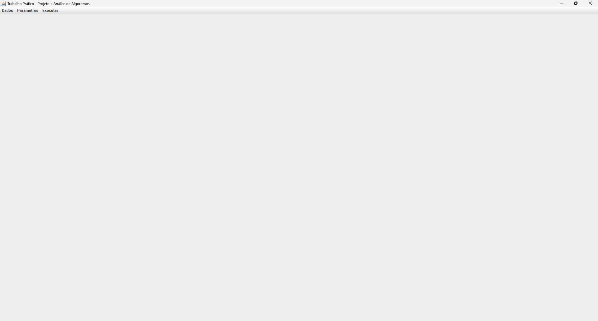
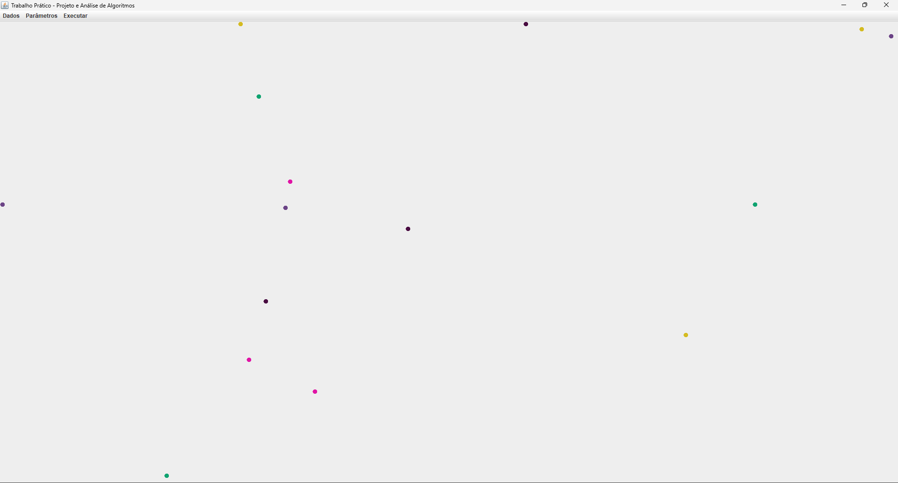
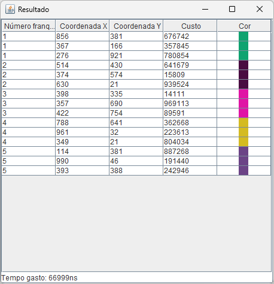
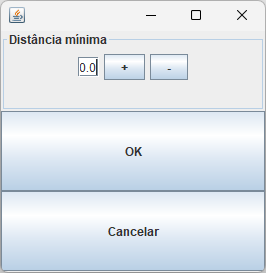

[English Version](README.EN.md)

# Trabalho Prático - Projeto e Análise de Algoritmos

## Enunciado

Valor: 35 pontos

Data: 23:00 horas de 10/06/2024 pelo Canvas. **Atenção: Para este trabalho não se admite atraso!**

### Descrição

Problemas de otimização são bastante comuns em vários setores produtivos. Um exemplo de aplicação é o planejamento da localização de instalações industriais ou comerciais em uma determinada região de interesse. Considere uma rede de lojas que deseja abrir n franquias, cada uma para um franqueado diferente. É importante que as lojas não fiquem muito próximas, de modo a não competirem pelos mesmos clientes. A empresa levantou os custos de instalação em diversos pontos e precisa escolher a solução que resulte no menor valor total, respeitando-se uma distância mínima entre cada loja.

Neste trabalho você deverá implementar uma solução para o problema de localização das lojas que minimize o valor total gasto com a instalação. Para cada uma das n franquias, existe uma relação de locais candidatos a serem escolhidos. Para cada ponto candidato, são conhecidos o valor da instalação, e sua posição em coordenadas x,y. Duas franquias quaisquer não podem estar a uma distância menor que D quilômetros, onde D é um parâmetro a ser informado na tela de entrada. Todos os pontos candidatos têm coordenadas x,y no intervalo de 0 a 500 quilômetros. Caso não seja possível uma solução que inclua as n franquias devido à restrição de distância, a solução ótima com maior número de franquias deve ser encontrada.

As informações sobre os pontos candidatos devem ser lidas de um arquivo texto contendo um ponto por linha. Cada linha contém o número da franquia, coordenada x, coordenada y e custo de instalação, separados por espaços. Todos os valores são números inteiros. Exemplo:

```
1 50 150 2000
1 150 150 1000
2 200 180 500
2 220 200 800
2 300 150 1000
3 100 250 800
3 180 220 500
3 150 300 700
4 220 220 400
4 300 300 1000
```

1. Escreva uma solução por força bruta para gerar as soluções possíveis e escolher a que leva ao menor valor total de instalação. O programa deve mostrar de forma gráfica como fica a disposição das franquias candidatas e os locais escolhidos.

2. Escreva uma solução por branch-and-bound, a partir da solução por força-bruta, que elimine ramos da árvore de soluções que se mostrarem improdutivas. Verifique se o resultado é o mesmo que o obtido por força-bruta e compare os tempos de processamento das duas soluções.

3. Faça um conjunto de simulações, gerando arquivos aleatórios para os valores de x, y e custo, variando o número de cidades, n, pelo menos entre 4 e 20, mantendo-se m=2 e D=1. Faça 10 simulações para cada valor de n e tire a média dos tempos de execução. Gere um gráfico com o tempo médio gasto em função de n. Compare os gráficos gerados pelas 2 soluções.

4. Documente as soluções e os testes, na forma de um relatório técnico em formato PDF com no máximo 20 páginas, segundo o padrão da SBC, contendo as seguintes seções:

a) Introdução: Descrever de maneira geral o objetivo do trabalho.

b) Solução proposta: Descrever de forma resumida os algoritmos usados para a solução do problema e analisar a sua ordem de complexidade com relação a tempo e memória no pior caso. Para a análise, considere que existem m pontos candidatos para cada uma das n filiais.

c) Implementação: Descrever detalhes dos programas implementados, principalmente aqueles utilizados para melhorar a eficiência da solução e como se organiza a interface gráfica.

d) Relatório de testes: Descrever os testes realizados e seus resultados, mostrando como ficou o mapa em alguns exemplos. Registrar o tempo de execução de cada um deles. Mostrar também o resultado da simulação.

e) Conclusão: Discutir os resultados obtidos, comparando as soluções por força-bruta e branch-and-bound, quanto à sua ordem de complexidade de tempo e memória, e quanto ao tempo de execução medido.

f) Bibliografia segundo o padrão ABNT.

### Considerações gerais e critérios de avaliação

1. O trabalho deverá ser feito em grupos de dois ou três alunos, sem qualquer participação de outros grupos e/ou ajuda de terceiros. Cada aluno deve participar ativamente em todas as etapas do trabalho. Os componentes dos grupos devem ser informados até o dia 30/04/2024 em uma planilha a ser divulgada e não poderão ser alterados. Os alunos que não tiverem feito grupos até esta data serão agrupados pelo professor de maneira arbitrária, em grupos de 2 ou 3 alunos.

2. A codificação do trabalho deve ser feita em linguagem Java, C++ ou Python. A apresentação poderá ser feita em um notebook levado pelo grupo ou em um computador do laboratório, Neste caso, não poderão ser utilizados bibliotecas gráficas ou qualquer recurso que não esteja instalado oficialmente nos laboratórios do ICEI.

3. Os trabalhos (código e relatório) devem ser postados na forma de um arquivo compactado no padrão ZIP, com **tamanho máximo de 5 MB**, e seu nome deve ser o número de matrícula de um dos componentes (Ex:346542.zip). **Os arquivos fontes e o relatório devem estar no diretório raiz** e devem conter o nome de todos os componentes do grupo no início do código. A apresentação será feita a partir do código postado no Canvas.

4. **Trabalhos iguais, na sua totalidade ou em partes, copiados, “encomendados” ou outras barbaridades do gênero, serão severamente penalizados. É responsabilidade do aluno manter o sigilo sobre seu trabalho, evitando que outros alunos tenham acesso a ele. No caso de cópia, ambos os trabalhos serão penalizados, independentemente de quem lesou ou foi lesado no processo.**

5. Será pedida ao Colegiado uma advertência formal no caso de cópia por má fé.

6. Durante a apresentação poderão ser feitas perguntas relativas ao trabalho, as quais serão consideradas para fim de avaliação. Todos os componentes devem comparecer e serem capazes de responder a **quaisquer perguntas e/ou alterar o código de qualquer parte do trabalho.** A avaliação será individual.

7. A avaliação será baseada nos seguintes critérios:

   * Correção, robustez e eficiência dos programas quanto ao tempo de processamento e uso de memória

   * Conformidade às especificações

   * Clareza e estilo de codificação (comentários, endentação, escolha de nomes para identificadores, parametrização)

   * Relatório

   * Apresentação individual

## Capturas de tela



*Janela principal, quando o programa é iniciado*


*Janela para a geração de dados aleatórios*



*Janela principal, mostrando o mapa de pontos escolhidos*



*Janela de resultados, mostrando a solução encontrada e o tempo gasto*


*Janela principal atrás da janela de resultados, mostrando o mapa, a
solução encontrada e o tempo gasto*


*Janela de abertura de arquivos*


*Janela de salvamento de arquivos*



*Janela para a configuração da distância mı́nima permitida entre os
pontos escolhidos*

## Download

O executável do programa pode ser baixado em [releases](https://github.com/Henriquemcc/Trabalho_Pratico_-_Projeto_e_Analise_de_Algoritmos_-_2024-1/releases). 

## Membros do Grupo

[Henrique Mendonça Castelar Campos](https://github.com/Henriquemcc)

[Thiago Gomes Martins](https://github.com/Thi23gm)